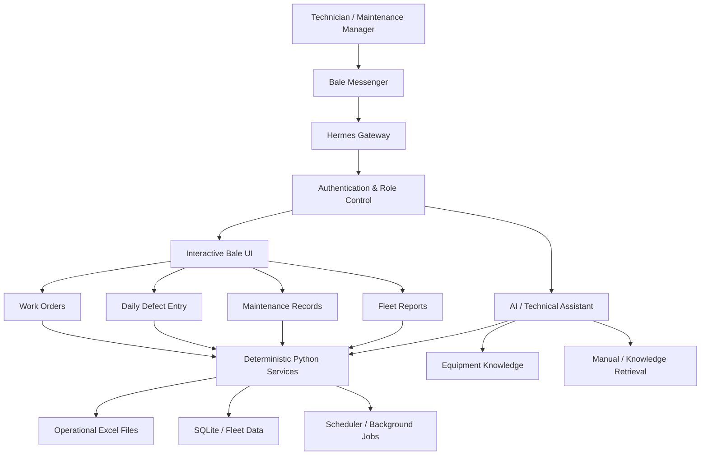

# KomatsoAI

**An open-source industrial maintenance and fleet-operations layer for Hermes Agent, built for real heavy-equipment workflows.**

KomatsoAI extends [Hermes Agent](https://github.com/NousResearch/hermes-agent) with deterministic operational workflows, role-based access, equipment-specific knowledge, Excel-backed maintenance records, work-order automation, scheduled reporting, and an interactive interface for Bale Messenger.

The project is being developed around real mining and heavy-equipment maintenance workflows rather than as a generic chatbot demo.

> **Repository scope:** this repository contains the custom KomatsoAI application layer and domain integrations.  
> Hermes Agent itself is not vendored here and is installed separately as the agent runtime.

---

## Why KomatsoAI exists

Maintenance teams working with mining and heavy equipment often have information split across:

- equipment manuals,
- Excel maintenance files,
- daily defect reports,
- work orders,
- service records,
- messaging applications,
- and the knowledge of individual technicians.

KomatsoAI connects those workflows to an AI agent while deliberately keeping critical operational actions deterministic.

The LLM is used for reasoning, search and technical assistance.

Operations such as writing maintenance records, issuing work orders, updating Excel files, scheduling reports and enforcing permissions are handled by normal Python code instead of being delegated blindly to an LLM.

---

## Architecture



---

## Key capabilities

### Industrial maintenance workflows

KomatsoAI provides structured maintenance workflows instead of relying only on free-form AI conversations.

Current workflows include:

- work-order creation and approval,
- daily mechanical defect entry,
- daily metalwork / fabrication defect entry,
- machine-specific maintenance history,
- repair technician and consumed-parts recording,
- scheduled operational reports,
- fleet-data processing,
- and equipment-aware technical assistance.

### Interactive Bale Messenger UI

Bale is used as the operational interface for technicians and maintenance personnel.

The project includes a reusable inline-keyboard framework for multi-step workflows such as:

- selecting an operation,
- choosing maintenance categories,
- adding or removing machines,
- confirming changes,
- cancelling workflows,
- and safely expiring old actions.

Each interaction is tied to the correct user, chat, workflow stage and revision to prevent stale callbacks from modifying operational data.

### Role-based access

Operational permissions are separated from AI reasoning.

For example, only authorized personnel can:

- create work orders,
- update daily defects,
- or write maintenance records.

Authorization is checked again before persistent changes are committed.

### Safe Excel automation

Many industrial organizations already depend heavily on Excel.

Rather than requiring an immediate migration away from those systems, KomatsoAI provides a controlled bridge between conversational workflows and existing operational workbooks.

The Excel layer includes protections for:

- concurrent writes,
- atomic file replacement,
- operation deduplication,
- audit logging,
- backups before modification,
- stale-data detection,
- Persian/Jalali dates,
- multiline text and row-height handling,
- and formula-injection prevention.

### Scheduled operational reporting

Background scheduling is kept independent from the LLM runtime.

Scheduled jobs can generate and deliver reports even when AI inference is unavailable.

This design separates:

```
AI reasoning
```

from:

```
critical operational automation
```

so temporary provider or model failures do not have to stop normal maintenance workflows.

---

## Equipment coverage

The current repository contains equipment-specific context and workflows for machines including:

- Komatsu HD465-7R / HD605-7R
- Komatsu HD785-5
- Komatsu HD785-7
- Komatsu PC1250-8R
- Komatsu PC800
- Komatsu WA600-6
- Hyundai R330LC-9S

The equipment layer is designed to expand as additional machines and technical sources are added.

---

## Repository structure

```
.
├── HD465-7R_HD605-7R/
├── HD785-5/
├── HD785-7/
├── PC1250-8R/
├── PC800/
├── R330LC-9S/
├── WA600-6/
│
├── tools/
│   ├── bale_ui/
│   ├── fleet/
│   └── scheduler/
│
├── reports/
│   └── fleet/
│
├── settings/
├── templates/
│   └── repairs/
│
├── test/
├── .env.example
└── ...
```

The repository intentionally contains the custom application and integration layer rather than a copy of Hermes Agent.

---

## Hermes Agent integration

KomatsoAI uses [Hermes Agent](https://github.com/NousResearch/hermes-agent?utm_source=chatgpt.com) as its agent runtime.

Hermes provides the underlying agent loop, model/provider integration, gateway infrastructure and tool execution.

KomatsoAI adds the industrial application layer on top:

```
Hermes Agent
     ↓
KomatsoAI integration layer
     ↓
Authentication / Bale UI
     ↓
Maintenance & fleet workflows
     ↓
Excel / SQLite / reports / scheduling
```

This separation keeps upstream Hermes development independent from the company-specific and industry-specific application logic in this repository.

---

## Reliability principles

The project follows several design rules for operational workflows:

**LLMs assist; deterministic code commits.**

Critical writes are performed by explicit Python services.

**Permissions are enforced in code.**

A conversational instruction cannot grant itself access to an operational function.

**Operations are recoverable.**

Persistent writes use backups, audit records and idempotent operation identifiers where appropriate.

**Concurrent users are isolated.**

Interactive workflows maintain user-specific state rather than sharing one global form state.

**Old UI actions expire safely.**

Inline actions are bound to their original user, message and workflow revision.

---

## Development and validation

The project includes unit tests and isolated rehearsals for operational Excel workflows.

Examples:

```
python -m unittest tools.fleet.repairs.test_entry_service tools.fleet.repairs.test_entry_bale -v
```

```
python -m unittest tools.fleet.repairs.test_maintenance_service tools.fleet.repairs.test_maintenance_bale -v
```

Some rehearsal tools run against isolated copies of real workbook layouts so formatting and historical records can be validated without modifying the live source files.

---

## Current status

KomatsoAI is under active development.

Current work focuses on:

- industrial maintenance workflows,
- fleet data ingestion,
- structured knowledge retrieval,
- reliable messaging integrations,
- operational reporting,
- and safe multi-user automation.

### Roadmap

Planned areas include:

- specialized agents for maintenance, inventory and management,
- richer fleet history and analytics,
- hybrid retrieval and reranking,
- maintenance evaluation datasets,
- local-model fallback for offline environments,
- improved observability,
- and migration of selected operational data from Excel into structured databases.

---

## Security

Do not commit production credentials, bot tokens, private operational workbooks or proprietary documents.

Use `.env.example` and local configuration for environment-specific secrets and paths.

If you discover a security issue, please avoid publishing production credentials or operational data in a public issue.

---

## Open source

KomatsoAI is intended to explore how general-purpose agent frameworks can be adapted to practical industrial maintenance environments, particularly workflows where existing spreadsheets, messaging tools and deterministic operational systems must coexist with AI reasoning.

Contributions, technical feedback and discussions about industrial AI-agent architectures are welcome.

---

## Acknowledgements

KomatsoAI is built as an application layer for [Hermes Agent](https://github.com/NousResearch/hermes-agent?utm_source=chatgpt.com), an open-source agent framework by Nous Research.

Hermes Agent is a separate project and is not included in this repository.

---

## License

MIT License. See [LICENSE](LICENSE).
